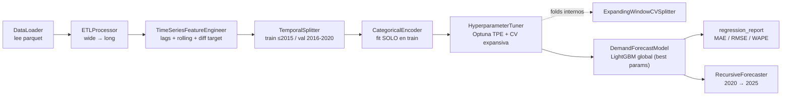

# Forecasting del Consumo Doméstico de Café — Informe Técnico

**Autor:** Pipeline MLOps `coffee_forecast.py`
**Fecha del análisis:** 2026-09-15 (revisión v2: corrección de extrapolación en árboles)
**Fuente de datos:** `coffee_db.parquet` (55 países, ciclos de cosecha 1990/91–2019/20)

---

## 1. Objetivo de negocio

Predecir el **consumo doméstico de café** de cada país para los próximos 5 ciclos de cosecha (**2020–2025**), utilizando el histórico 1990–2019, con la métrica de negocio **WAPE (Weighted Absolute Percentage Error)** como criterio principal de éxito porque pondera los errores por volumen real de consumo — un error de 100.000 kg en Brasil no pesa lo mismo que en un país pequeño.

---

## 2. Datos de entrada

| Propiedad | Valor |
|---|---|
| Filas (wide) | 55 (una por país) |
| Columnas de año | 30 (`1990/91` … `2019/20`) |
| Filas tras `melt` (long) | 1.650 (55 países × 30 años) |
| Variable objetivo | `Consumption` (kg) |
| Variables estáticas por país | `Country`, `Coffee_type` |
| Columna descartada | `Total_domestic_consumption` |

> **Por qué se descarta `Total_domestic_consumption`:** es la suma de *todos* los años 1990–2019 por fila. Usarla como *feature* filtraría información del futuro (2016-2019) hacia años de entrenamiento anteriores (data leakage), violando el requisito de validación temporal estricta.

---

## 3. Arquitectura del pipeline (`coffee_forecast.py`)

El script está modularizado en clases de responsabilidad única, siguiendo el flujo `Carga → ETL → Feature Engineering → Split → Tune → Fit → Evaluate → Forecast` orquestado por `main()`.



| Clase / función | Responsabilidad | Garantía anti-leakage |
|---|---|---|
| `DataLoader` | Lee el parquet crudo | — |
| `ETLProcessor` | `melt` wide→long, parsea `"1990/91"→1990`, ordena por `Country, Year` | Elimina `Total_domestic_consumption` |
| `TimeSeriesFeatureEngineer` | Genera `lag_1/2/3`, `rolling_mean_3`, `rolling_std_3` y el target diferenciado `Consumption_diff` | Todo se calcula sobre `shift(1)`: solo pasado visible |
| `CategoricalEncoder` | Label-encoding de `Country` / `Coffee_type` | `fit()` únicamente con partición de **train**; categorías no vistas → código `-1` |
| `TemporalSplitter` | Corte por año, sin aleatoriedad | Train ≤ 2015, Validación 2016–2020 (sin `train_test_split`/`KFold`) |
| `ExpandingWindowCVSplitter` | Genera *folds* de validación cruzada por bloques de años, **solo dentro de train** | Cada fold valida en años estrictamente posteriores a su propio entrenamiento |
| `HyperparameterTuner` | Búsqueda bayesiana (Optuna/TPE) minimizando el WAPE promedio de los folds de CV | Nunca toca el holdout 2016-2020; solo usa años ≤ 2015 |
| `DemandForecastModel` | Envuelve un `LGBMRegressor` global (multi-país) con hiperparámetros configurables | Entrenado exclusivamente con `train_clean` |
| `weighted_absolute_percentage_error` / `regression_report` | Cálculo de MAE, RMSE, WAPE | — |
| `reconstruct_level_from_diff` | Reconstruye el nivel ($y_t = \text{lag}_1 + \widehat{\Delta y}_t$) a partir de la predicción diferenciada | — |
| `RecursiveForecaster` | Proyecta 2020-2025 realimentando sus propias predicciones como lags | Usa solo historia real + predicciones propias, nunca datos futuros reales |
| `main()` | Orquesta el flujo end-to-end y persiste resultados | — |

El script `generate_report_assets.py` reutiliza estas mismas clases (no duplica lógica) únicamente para producir los gráficos de este informe.

---

## 4. Formalismo teórico


### 4.1 De panel ancho a panel largo (Data de tipo *panel*)

Cada país $i$ define una serie temporal $\{y_{i,t}\}_{t=1990}^{2019}$. El dataset original almacena esta serie como columnas separadas; el `melt` la convierte en la representación estándar de **datos de panel**:

$$
\text{Wide}(i, t) \;\longrightarrow\; \text{Long}: \big(i,\ t,\ y_{i,t}\big), \quad i \in \{1,\dots,55\},\ t\in\{1990,\dots,2019\}
$$

Esto permite entrenar un **modelo global** (pooled model) que aprende patrones compartidos entre países en lugar de 55 modelos univariantes independientes.

### 4.2 Features autorregresivas (lags) y estadísticos móviles

Para cada observación $(i, t)$ se generan variables que dependen exclusivamente del pasado de esa misma serie:

$$
\text{lag}_k(i, t) = y_{i,\, t-k}, \qquad k \in \{1, 2, 3\}
$$

$$
\text{rolling\_mean}_3(i, t) = \frac{1}{3}\sum_{j=1}^{3} y_{i,\, t-j}
\qquad\qquad
\text{rolling\_std}_3(i, t) = \sqrt{\frac{1}{2}\sum_{j=1}^{3}\big(y_{i,t-j} - \text{rolling\_mean}_3(i,t)\big)^2}
$$

El uso de `shift(1)` antes de aplicar la ventana móvil garantiza que **ninguna feature en el instante $t$ observe $y_{i,t}$ o valores futuros** — condición necesaria y suficiente para que el *forecasting* recursivo sea válido.

### 4.3 Validación temporal (*Expanding Window*)

En series temporales, `KFold` o `train_test_split` aleatorios rompen la flecha del tiempo (entrenarías con 2018 y validarías con 2005). Se aplica en su lugar una partición por bloques temporales:

$$
\text{Train} = \{(i,t) : t \le 2015\}, \qquad \text{Validation} = \{(i,t) : 2016 \le t \le 2020\}
$$

Todo *encoder* (aquí, `CategoricalEncoder`) se ajusta (`fit`) exclusivamente sobre $\text{Train}$ y luego se aplica (`transform`) sobre $\text{Validation}$, replicando el comportamiento real en producción: en el momento de entrenar, el futuro es desconocido.

### 4.4 Modelo: Gradient Boosted Trees (LightGBM)

LightGBM construye un modelo aditivo de $M$ árboles de decisión $h_m(x)$, entrenados secuencialmente para corregir el error residual del ensamble anterior:

$$
F_M(x) = \sum_{m=1}^{M} \eta \cdot h_m(x), \qquad
h_m = \arg\min_{h} \sum_{n=1}^{N} \left[ \frac{\partial \mathcal{L}(y_n, F_{m-1}(x_n))}{\partial F_{m-1}(x_n)} - h(x_n) \right]^2
$$

donde $\eta$ es el `learning_rate` y $\mathcal{L}$ es la pérdida cuadrática (regresión). Se eligió LightGBM sobre modelos lineales porque:

- Maneja de forma **nativa** variables categóricas (`Country`, `Coffee_type`) sin necesidad de one-hot encoding de alta dimensionalidad.
- Captura interacciones no lineales entre país, tendencia temporal y dinámica autorregresiva sin especificarlas manualmente.
- Es robusto a features en escalas heterogéneas (no requiere estandarización).

### 4.5 Optimización de hiperparámetros: búsqueda bayesiana (Optuna/TPE) + CV temporal anidada

Los hiperparámetros de LightGBM (`n_estimators`, `learning_rate`, `num_leaves`, `min_child_samples`, `subsample`, `colsample_bytree`, `reg_alpha`, `reg_lambda`) ya **no se fijan a mano**: se buscan con **Optuna** usando el sampler **TPE (Tree-structured Parzen Estimator)**, un método de optimización bayesiana secuencial.

**¿Por qué TPE/Optuna y no Grid/Random Search o `GridSearchCV`/`RandomizedSearchCV` de scikit-learn?**

- El espacio de búsqueda mezcla enteros, flotantes y escalas logarítmicas (`learning_rate`, `reg_alpha`, `reg_lambda` varían en órdenes de magnitud) — TPE modela $p(\text{hiperparámetro} \mid \text{score})$ y concentra las siguientes propuestas en la región prometedora, en vez de explorar la grilla completa o muestrear a ciegas.
- `GridSearchCV`/`RandomizedSearchCV` de scikit-learn asumen internamente una estrategia de CV compatible con su API (`KFold`, `TimeSeriesSplit` de filas) — aquí se necesitaba una CV **por bloques de año** consciente de que múltiples países comparten el mismo año, algo que se implementó a medida (`ExpandingWindowCVSplitter`). Optuna es agnóstico a la estrategia de validación: solo necesita una función objetivo, por lo que se integra limpiamente con el splitter custom.
- Con un dataset pequeño (~1.265 filas de train), TPE converge en pocas decenas de *trials* (40 en este caso), lo cual es más eficiente en tiempo de cómputo que una grilla exhaustiva.

**Validación anidada sin fuga de información (`ExpandingWindowCVSplitter`):** cada intento (*trial*) de Optuna se evalúa con **validación cruzada de ventana expansiva**, construida exclusivamente con años $\le$ `train_end_year` (2015) — el set de holdout 2016-2020 **nunca** participa en la búsqueda de hiperparámetros, preservando una estimación honesta de generalización al final:

$$
\text{Fold}_k:\quad \text{Train}_k = \{t \le \tau_k\}, \qquad \text{Val}_k = \{\tau_k+1 \le t \le \tau_k + w\}, \qquad \tau_1 < \tau_2 < \dots < \tau_K \le 2015
$$

donde $w$ = `cv_val_years` (2 años por fold) y $K$ = `cv_n_splits` (hasta 3 folds, descartando los que no cumplan `cv_min_train_years` años mínimos de historia). La función objetivo que Optuna minimiza es el **WAPE promedio de los $K$ folds** — la misma métrica de negocio usada en el reporte final, para que la búsqueda optimice directamente lo que le importa a negocio y no un proxy (como MSE).

### 4.6 Métricas de evaluación

$$
\text{MAE} = \frac{1}{N}\sum_{n=1}^N |y_n - \hat{y}_n|
\qquad
\text{RMSE} = \sqrt{\frac{1}{N}\sum_{n=1}^N (y_n - \hat{y}_n)^2}
$$

$$
\text{WAPE} = \frac{\displaystyle\sum_{n=1}^N |y_n - \hat{y}_n|}{\displaystyle\sum_{n=1}^N |y_n|}
$$

WAPE es la métrica de negocio preferida frente a MAPE porque no se dispara con países de bajo consumo (evita divisiones por valores pequeños) y su interpretación es directa: **porcentaje del volumen total de café mal predicho**.

### 4.7 Forecasting recursivo multi-step (2020-2025)

Como 2020-2025 no tiene valores reales, no existen `lag`/`rolling` verdaderos. `RecursiveForecaster` los reconstruye iterativamente:

$$
\hat{y}_{i,\,2020} = F_M\big(\text{lag}_{1..3}(i,2020),\ \text{rolling}(i,2020),\ \dots\big)
$$

$$
\hat{y}_{i,\,2020+h} = F_M\Big(\underbrace{\hat{y}_{i,2020+h-1}, \dots, \hat{y}_{i,2020+h-3}}_{\text{lags reconstruidos con predicciones propias}},\ \text{rolling}(\hat{y}),\ \dots\Big), \quad h=1,\dots,4
$$

Esto es exactamente el esquema **recursivo** (a diferencia de un enfoque *direct* con un modelo por horizonte): el error de un paso se propaga al siguiente, por lo que la incertidumbre crece con el horizonte — comportamiento esperado y documentado en la sección de limitaciones.

### 4.8 Por qué el target es un *diff* y no el nivel absoluto (auditoría v2)

Una revisión externa de este pipeline señaló dos puntos, que se auditaron y resolvieron a continuación:

| # | Observación externa | Veredicto tras auditoría | Acción |
|---|---|---|---|
| A | "`rolling_std_3` usa `ddof=0` en entrenamiento pero `ddof=1` en el forecast recursivo → *covariate shift*" | **Falso.** `pandas.Series.rolling().std()` usa `ddof=1` por defecto — se verificó numéricamente que `shifted.rolling(3).std()` y `np.std(window, ddof=1)` producen el **mismo valor** (`1.5275252316519468` en un caso de prueba). No existía inconsistencia. | Se dejó `ddof=1` explícito en ambos lados del código únicamente por claridad defensiva, sin cambio de comportamiento. |
| B | "`Year` como feature numérica cruda impide que LightGBM extrapole más allá de 2015, aplanando el forecast" | **Correcto.** Los árboles particionan sobre `Year > 2015` y no pueden generar un valor distinto para 2020 vs. 2025 a partir de esa sola variable. | **Corregido** (ver más abajo): se retiró `Year` del set de features y se reformuló el target. |

**Fix aplicado — Target en primera diferencia:** en lugar de predecir el nivel $y_{i,t}$, el modelo predice la variación interanual:

$$
\Delta y_{i,t} = y_{i,t} - y_{i,t-1} = y_{i,t} - \text{lag}_1(i,t)
$$

y en inferencia se reconstruye el nivel sumando la última observación conocida (real o previamente predicha):

$$
\hat{y}_{i,t} = \text{lag}_1(i,t) + \widehat{\Delta y}_{i,t}
$$

Esto es la técnica clásica de **differencing** para volver (casi) estacionaria una serie con tendencia, evitando que el árbol necesite extrapolar la variable de nivel/año fuera de rango: el target $\Delta y$ tiene una escala mucho más acotada y estable año a año que $y$ en valor absoluto, y la tendencia se preserva porque cada paso recursivo suma su propio $\Delta \hat y$ sobre el nivel anterior. `Year` se eliminó del feature set porque, una vez diferenciado el target, ya no aporta señal más allá de la que capturan los lags/rolling — y sí conservaba el riesgo de partición fija fuera de rango.

---

## 5. Resultados de validación (2016-2019)

| Métrica | Sin tuning (v2) | **Con tuning Optuna (v3)** |
|---|---|---|
| **MAE** | 1.457.102,50 kg | **1.393.352,94 kg** |
| **RMSE** | 4.981.757,07 kg | **4.416.196,57 kg** |
| **WAPE** | 2,69 % | **2,58 %** |

Con el target diferenciado (sección 4.8) el WAPE ya había bajado de 5,61 % a 2,69 %. Añadiendo la búsqueda bayesiana de hiperparámetros (sección 4.5) sobre CV de ventana expansiva, el WAPE de validación baja otro medio punto porcentual a **2,58 %**, con reducciones más notorias en RMSE (-11,4%) — la búsqueda encontró un modelo con más árboles pero *learning_rate* más bajo y regularización (`reg_alpha`, `reg_lambda`) más fuerte, lo que reduce el sobreajuste a observaciones atípicas.

**Mejores hiperparámetros encontrados** (40 *trials*, WAPE promedio de CV = 2,33 %):

| Hiperparámetro | Valor |
|---|---|
| `n_estimators` | 600 |
| `learning_rate` | 0,0137 |
| `num_leaves` | 13 |
| `min_child_samples` | 9 |
| `subsample` | 0,733 |
| `colsample_bytree` | 0,941 |
| `reg_alpha` | 1,058 |
| `reg_lambda` | 9,484 |


### 5.1 Convergencia de la búsqueda de hiperparámetros


El WAPE de CV cae rápidamente en los primeros ~10 *trials* y luego se estabiliza — señal de que TPE concentró la búsqueda en la región de mejores hiperparámetros en vez de seguir explorando a ciegas, y de que 40 *trials* son suficientes para este espacio de búsqueda y tamaño de dataset (*trials* adicionales ya no mejoran el mínimo).

### 5.2 Real vs. Predicho


La nube de puntos se alinea de forma consistente con la diagonal $y=x$; la mayor dispersión ocurre en los países de mayor volumen (Brasil), donde errores absolutos grandes son proporcionalmente pequeños (coherente con el WAPE bajo).

### 5.3 Importancia de variables


Al predecir $\Delta y_t$, `rolling_std_3` y `lag_1` dominan la importancia: la volatilidad reciente del país (`rolling_std_3`) ayuda al modelo a distinguir cuánto puede variar la próxima diferencia, mientras que `lag_1` ancla la magnitud del cambio al nivel más reciente. `Country_encoded` aporta un efecto residual de escala/estacionalidad por país, y `Coffee_type_encoded` prácticamente no aporta señal una vez que el target está diferenciado — coherente con que el tipo de café es una característica estática que ya queda absorbida por `Country_encoded`.

---

## 6. Proyección 2020-2025


A diferencia de la versión inicial (líneas perfectamente planas por país), el forecast ahora **preserva la tendencia** observada en el histórico reciente de cada país (p. ej. Brasil y Etiopía continúan su pendiente ascendente, México se mantiene estable en línea con su meseta 2015-2019) — resultado directo de predecir $\Delta y$ en vez del nivel absoluto.

El resultado completo por país/año se persiste en [`future_forecast_2020_2025.csv`](future_forecast_2020_2025.csv).

---

## 7. Limitaciones y próximos pasos

1. **Incertidumbre creciente con el horizonte**: al ser recursivo, el error de 2020 se propaga a 2021-2025. Se recomienda reportar también un intervalo de predicción (p. ej. *quantile regression* con LightGBM) para 2024-2025.
2. **Ausencia de variables exógenas**: precio internacional del café, PIB per cápita o población no están incluidas; podrían reducir aún más el WAPE.
3. **Tamaño de muestra**: 55 países × 30 años es un panel pequeño para gradient boosting; validar con *walk-forward* multi-fold (2010→2015→2019) daría una estimación de error más robusta que un único corte.
4. **Diferenciación de orden 1 asume estacionariedad aproximada**: si algún país tuviera un cambio estructural fuerte (p. ej. una política que duplica el consumo de un año a otro), el modelo tardaría en capturarlo porque sigue dependiendo de lags recientes. Un chequeo de estacionariedad por país (ADF test) es un siguiente paso razonable.
5. **Solo 3 folds de CV interna para tuning**: con un panel de 55 países × ~26 años de train, más folds reducirían la varianza de la estimación de WAPE por *trial*, a costa de más tiempo de cómputo (cada *trial* reentrena LightGBM por fold). `cv_n_splits`, `cv_val_years` y `n_trials` son parámetros de `PipelineConfig` pensados para escalarse si el dataset crece.

---

## 8. Cómo reproducir

```powershell
python coffee_forecast.py            # ETL -> features -> tuning (Optuna) -> fit -> evalúa -> genera future_forecast_2020_2025.csv
python generate_report_assets.py     # regenera los gráficos de este informe (reports/figures/)
```
